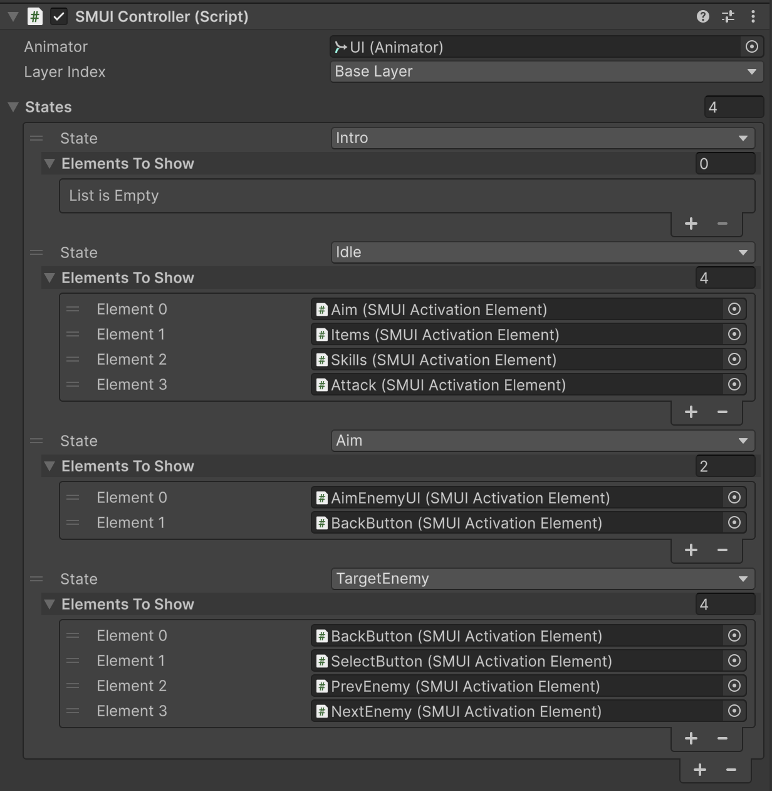

# SMUI

**SMUI** lets you manage UI (and other) elements in Unity using the Animator Controller's state machines. It provides a flexible way to show, hide, or animate elements depending on the current state of your Animator.

---

## 📦 Installation

### Install via Unity Package Manager

1. Open your Unity project.  
2. Go to **Window → Package Manager**.  
3. Click the **+** button in the top-left corner.  
4. Select **Add package from git URL…**  
5. Enter the URL: `https://github.com/ZhengYiHu/SMUI.git`

### Download Unity Package File

You can also download the package file directly from the [Releases folder](https://github.com/ZhengYiHu/SMUI/tree/main/Releases).

---

## ⚡ Usage

1. **Set up an Animator Controller**  
- Create an Animator Controller to use as your state machine.  
- Configure the states corresponding to the different UI (or game) element configurations.  

2. **Attach `SMUIController`**  
- Add the `SMUIController.cs` script to a GameObject.  
- Assign the Animator and define which elements should be visible in each state.  

3. **Prepare controllable elements**  
- Each GameObject you want to control should have a child with an `SMUIElement` attached.  
- The demo uses `SMUIActivationElement` to activate/deactivate GameObjects, but you can implement custom behaviors such as:  
  - Fading in/out  
  - Playing animations  
  - Any other state-dependent effect  

---

## ✨ Features

- State-driven UI management  
- Easily extendable to custom element behaviors  
- Integrates seamlessly with Unity Animator  

---

## 📄 License

This project is licensed under the **MIT License**.
